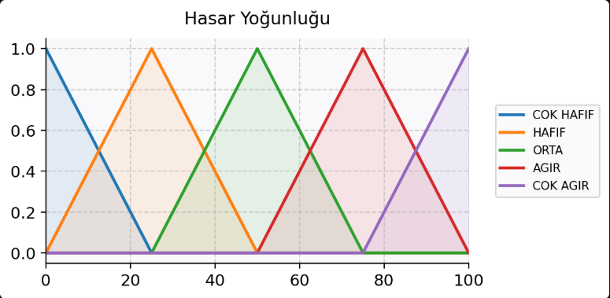
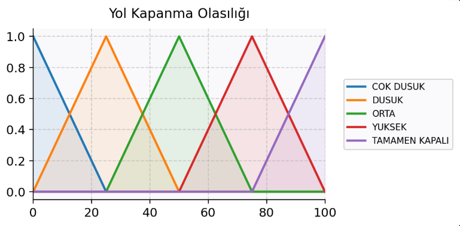
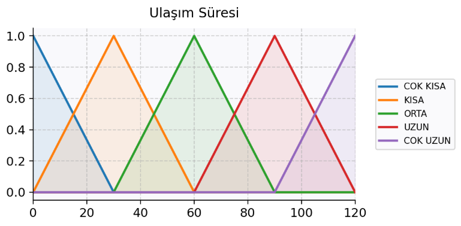
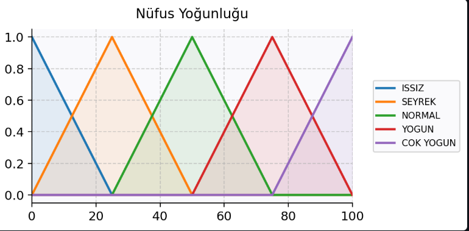
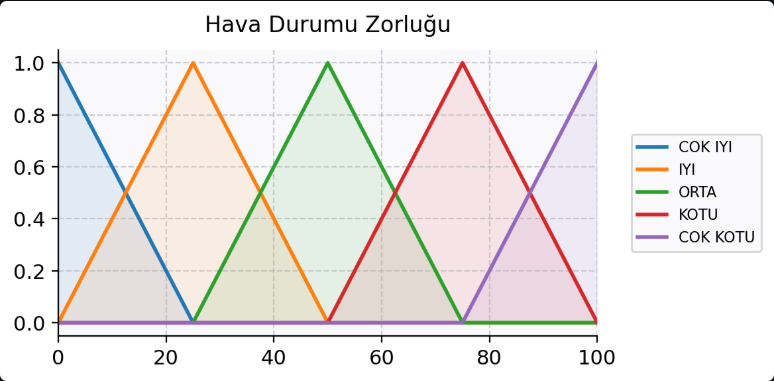
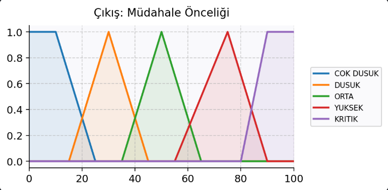
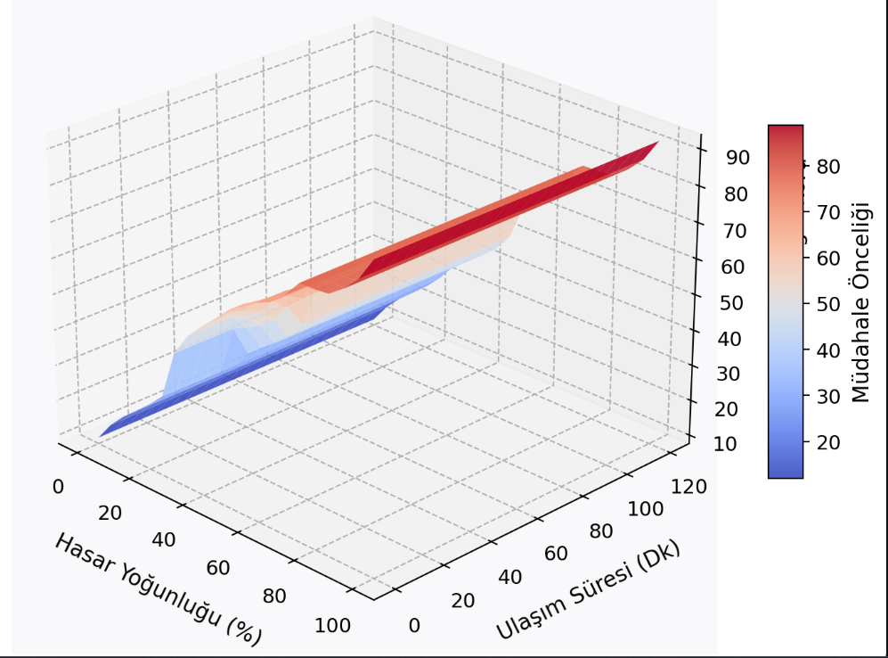

# 🚁 Doğal Afet Sonrası Dinamik Kaynak Tahsis Simülasyonu

Bu proje, bir doğal afet (deprem, sel vb.) sonrasında sınırlı sayıdaki arama-kurtarma ekiplerinin ve acil durum kaynaklarının hangi bölgelere **hangi öncelikle** sevk edileceğini hesaplayan profesyonel bir **Bulanık Mantık (Fuzzy Logic)** uzman sistemidir.

Proje, AFAD ve benzeri afet yönetim merkezlerinin karşılaştığı "gerçek dünya belirsizliklerini" (kötü hava koşulları, kapanan yollar, tahmini hasar durumları vb.) matematiksel olarak modelleyerek en optimum kararı üretmeyi hedefler.

---

## 🛠️ Teknolojik Altyapı
*   **Programlama Dili:** Python 3.x
*   **Bulanık Mantık Motoru:** `scikit-fuzzy`
*   **Matematiksel Hesaplama:** `numpy`
*   **Görselleştirme:** `matplotlib`
*   **Kullanıcı Arayüzü (GUI):** `streamlit`

---

## 🧠 Bulanık Mantık Mimarisi

Sistem, **5 Girişli ve 1 Çıkışlı** gelişmiş bir mimariye sahiptir. Tüm hesaplamalarda **Centroid (Ağırlık Merkezi)** durulaştırma metodu kullanılmıştır. Sistemin çökmesini engelleyen ve 3.125 farklı olasılık evrenini kapsayan 20 maddelik özel bir "Güvenlik Ağlı" kural tabanı mevcuttur.

### Giriş Değişkenleri (Inputs)
1.  **Hasar Yoğunluğu (%):** Bölgedeki tahmini fiziksel yıkım oranı. *(Çok Hafif, Hafif, Orta, Ağır, Çok Ağır)*
2.  **Yol Kapanma Olasılığı (%):** Bölgeye giden yolların moloz vb. sebeple kapalı olma ihtimali. *(Çok Düşük, Düşük, Orta, Yüksek, Tamamen Kapalı)*
3.  **Ulaşım Süresi (Dakika):** Merkezin bölgeye olan uzaklığı. *(Çok Kısa, Kısa, Orta, Uzun, Çok Uzun)*
4.  **Nüfus Yoğunluğu (%):** Bölgedeki tahmini insan yoğunluğu. *(Issız, Seyrek, Normal, Yoğun, Çok Yoğun)*
5.  **Hava Koşulları Zorluğu (%):** Arama kurtarmayı zorlaştıracak hava muhalefeti (fırtına, kar vb.). *(Çok İyi, İyi, Orta, Kötü, Çok Kötü)*

### Çıkış Değişkeni (Output)
*   **Müdahale Öncelik Skoru (0-100):** Ekiplerin o bölgeye gitme aciliyeti. *(Çok Düşük, Düşük, Orta, Yüksek, Kritik)*

---

## 📊 Üyelik Fonksiyonları Grafikleri

*(Not: Aşağıdaki grafikleri GitHub'da görüntüleyebilmek için, uygulamanızın 2. sekmesinden aldığınız ekran görüntülerini proje klasörü içine `assets` adında bir klasör açıp içine kaydetmelisiniz)*

### 1. Hasar Yoğunluğu


### 2. Yol Kapanma Olasılığı


### 3. Nüfus Yoğunluğu


### 4. Ulaşım Süresi


### 5. Hava Durumu Zorluğu


### 6. Çıkış: Müdahale Önceliği


---

## 🌐 3 Boyutlu Karar Yüzeyi (Decision Surface)

Sistemin çok boyutlu mantıksal çıkarımını (Inference) görselleştiren 3B Karar Yüzeyi grafiği aşağıdadır. Bu grafik, Hava Durumu, Nüfus ve Yol Kapanma olasılığı formda belirli değerlerde sabit tutulduğunda; **Hasar Yoğunluğu** ve **Ulaşım Süresi**'nin müdahale önceliğini nasıl dinamik olarak şekillendirdiğini gösterir.



---

## 🚀 Kurulum ve Çalıştırma

Projeyi yerel bilgisayarınızda çalıştırmak için aşağıdaki adımları izleyin:

**1. Gerekli Kütüphaneleri Yükleyin:**
Terminal (Komut Satırı) ekranını açın ve aşağıdaki komutu çalıştırarak gerekli paketleri indirin:
```bash
pip install numpy scikit-fuzzy matplotlib streamlit
```

**2. Uygulamayı Başlatın:**
Projenin bulunduğu dizinde (klasörde) terminal üzerinden şu komutu çalıştırın:
```bash
streamlit run app.py
```

**3. Kullanım:**
Uygulama tarayıcınızda (localhost:8501) açılacaktır. Sol panelden (Sidebar) sensör değerlerini değiştirip kırmızı renkli **"Müdahale Önceliğini Hesapla"** butonuna basarak anlık sonuçları, tetiklenen kuralları ve centroid grafiğini görüntüleyebilirsiniz.

---

## 💡 Örnek Senaryo Analizi (Ters Mantık Durumu)
Sistem sadece en yüksek değerleri değil, "mantıklı" olanı seçer. Örneğin bir bölgede **Hasar %100** olsa bile, eğer o bölgeye giden **Yollar Tamamen Kapalı (%100)** ve **Hava Koşulları Felaket (%100)** seviyesindeyse; sistem karadan müdahale önceliğini otomatik olarak **Çok Düşük (18/100)** seviyesine çeker. 

Çünkü klasik algoritmaların (Hasar varsa hemen git) aksine Bulanık Mantık sistemi; karadan gidişin imkansız olduğunu, kaynakların yolda israf edileceğini öngörür. Bu durum projenin gerçek dünya şartlarına ne kadar uygun tasarlandığının en büyük kanıtıdır.

---
**Geliştirici:** Ahmet Şimşek
